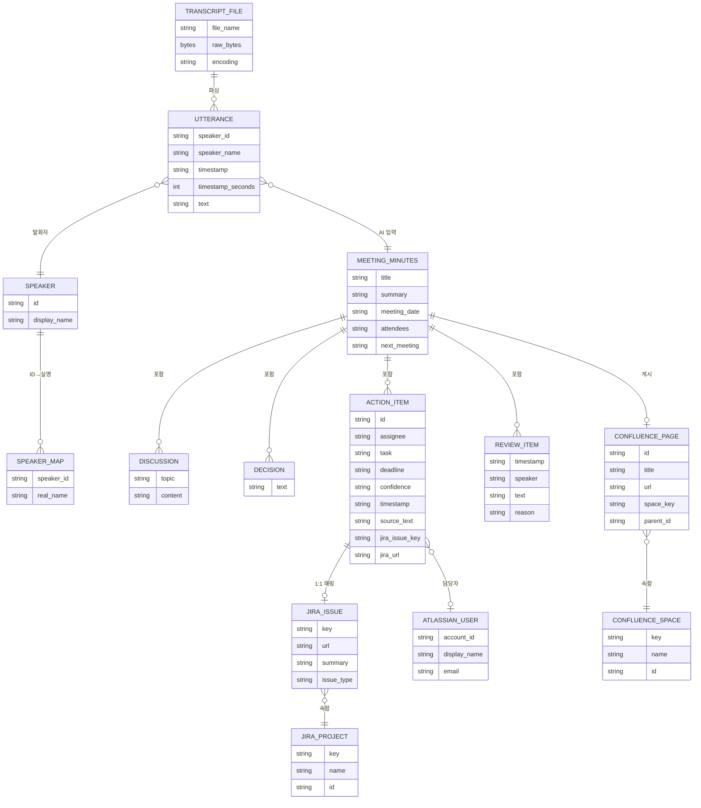
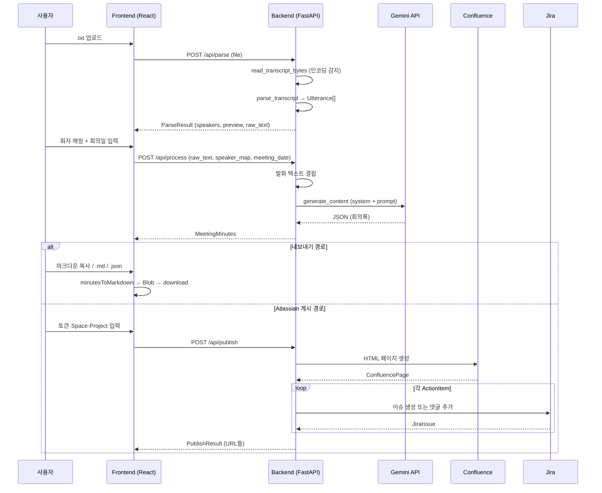

# ERD — AI 회의록 자동화

**문서 버전**: v1.1 (2026-06-19)

> 이 앱은 **자체 데이터베이스가 없다**. 회의록은 요청 단위로 메모리에서 처리되고 곧바로 외부 시스템(Confluence/Jira) 또는 사용자 다운로드로 흘러간다. 아래는 그 흐름 안에 존재하는 **도메인 모델**과 **외부 시스템 엔티티**의 관계도다.

---

## 1. 도메인 엔티티 다이어그램

---

## 2. 엔티티 정의

### 내부 도메인 엔티티

| 엔티티 | 정의처(코드) | 설명 |
|---|---|---|
| **TranscriptFile** | UploadFile (frontend → /api/parse) | 사용자가 업로드한 .txt 파일. 인코딩 자동 감지 |
| **Utterance** | `text_parser.py:Utterance` | 한 발화 단위 (화자/시간/내용) |
| **Speaker** | `text_parser.get_speakers` | 전사에 등장한 고유 화자 ID 리스트 |
| **SpeakerMap** | `WizardState.speakerMap` | "1" → "홍길동" 매핑 |
| **MeetingMinutes** | `claude_processor.MeetingMinutes` | AI가 생성한 구조화 회의록 (루트 객체) |
| **Discussion** | `MeetingMinutes.discussions[]` | 토픽 + 내용 |
| **Decision** | `MeetingMinutes.decisions[]` (string) | 결정사항 한 줄 |
| **ActionItem** | `MeetingMinutes.action_items[]` | 담당자·업무·기한·신뢰도 |
| **ReviewItem** | `MeetingMinutes.review_items[]` | 잡담/불명확 발화 (AI가 분리) |

### 외부 시스템 엔티티 (참조만)

| 엔티티 | 출처 |
|---|---|
| **ConfluenceSpace** | GET /wiki/api/v2/spaces |
| **ConfluencePage** | POST /wiki/api/v2/pages (회의록 게시 결과) |
| **JiraProject** | GET /rest/api/3/project |
| **JiraIssue** | POST /rest/api/3/issue (액션 아이템 1:1 생성) |
| **AtlassianUser** | GET /rest/api/3/user/assignable/search |

---

## 3. 데이터 흐름

---

## 4. 영속성·보존 정책

| 데이터 | 보존 위치 | 보존 기간 |
|---|---|---|
| 업로드한 전사 파일 | 메모리 (요청 처리 중) | 요청 종료 시 폐기 |
| MeetingMinutes 결과 | 브라우저 (WizardState) | 새로고침/리셋 시 폐기 |
| 사용자 다운로드한 .md / .json | 사용자 로컬 | 사용자 관리 |
| Confluence 페이지 / Jira 이슈 | 사용자 Atlassian 워크스페이스 | 영구 |
| API 토큰 (Gemini) | 호스팅 환경변수 (Render) | 운영자 관리 |
| Atlassian 토큰 | 저장 안 함 | 매 요청마다 사용자가 입력 |

> **핵심**: 회의록 본문은 서버에 남지 않는다. 게시하거나 내보내지 않으면 사라진다.

---

## 5. 관계 카디널리티

| 관계 | 카디널리티 | 비고 |
|---|---|---|
| TranscriptFile → Utterance | 1 : N | 보통 수십~수백 개 |
| MeetingMinutes → Discussion | 1 : N | 보통 3~10 토픽 |
| MeetingMinutes → ActionItem | 1 : N | 보통 5~20개 |
| MeetingMinutes → ConfluencePage | 1 : 0..1 | 게시 옵션 |
| ActionItem → JiraIssue | 1 : 0..1 | 신뢰도 "확실"만 자동 생성하는 정책 가능 |
| ActionItem → AtlassianUser | N : 0..1 | 담당자 매핑 시 |
| JiraProject → JiraIssue | 1 : N | — |
| ConfluenceSpace → ConfluencePage | 1 : N | — |
