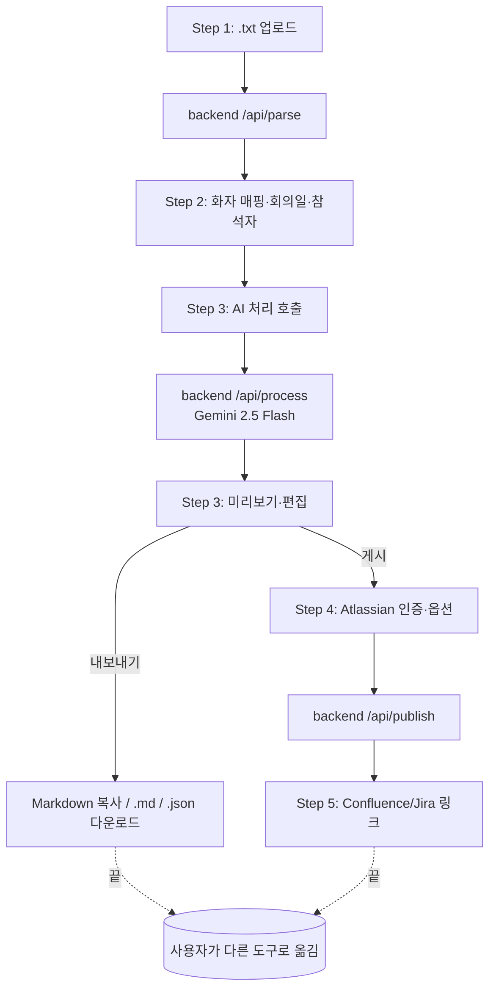

# IA — AI 회의록 자동화

**문서 버전**: v1.1 (2026-06-19)
정보 구조 · 화면 흐름 · 컴포넌트 트리

---

## 1. 사이트맵

이 앱은 단일 페이지(SPA) 마법사 구조다. URL이 바뀌지 않고, 내부 단계(Step)로 화면을 전환한다.

```
/  (메인 마법사)
├── Step 1  파일 업로드
├── Step 2  화자 매핑
├── Step 3  회의록 미리보기·편집
│             └── (내보내기 패널: 마크다운 복사 / .md / .json)
├── Step 4  게시 설정 (Atlassian)
└── Step 5  게시 완료
```

외부로 나가는 링크:
- Confluence 페이지 (게시 후)
- Jira 이슈 (게시 후)

---

## 2. 사용자 플로우



---

## 3. 화면별 정보 요소

### Step 1 — 파일 업로드

| 영역 | 요소 |
|---|---|
| 헤더 | 진행 표시(1/5) |
| 본문 | 드래그&드롭 영역, 파일 선택 버튼, 지원 형식 안내 |
| 상태 | 업로드 중 스피너, 오류 메시지 |
| 액션 | **다음** (파일 파싱 후 활성화) |

### Step 2 — 화자 매핑

| 영역 | 요소 |
|---|---|
| 본문 | 화자 ID → 실명 입력 필드 (N개), 회의 일자, 참석자, 전사 미리보기 |
| 액션 | **이전 / 다음** |

### Step 3 — 미리보기·편집

| 영역 | 요소 |
|---|---|
| 헤더 | 회의록 제목 (편집 가능), **↺ 재생성** |
| 요약 | AI 생성 한 단락 |
| 주요 논의 | 토픽 + 내용 카드 |
| 결정사항 | 리스트 |
| 액션 아이템 | 테이블 (신뢰도/담당자/업무/기한/시간), 행 추가·삭제·인라인 편집 |
| 검토 필요 | 접이식 섹션 (시간/화자/발화/이유) |
| **내보내기** | 마크다운 복사, .md 다운로드, .json 다운로드 |
| 액션 | **이전 / 게시 설정** |

### Step 4 — 게시 설정

| 영역 | 요소 |
|---|---|
| Confluence | 도메인, 이메일, API 토큰, Space 선택(드롭다운), 부모 페이지 ID(선택) |
| Jira | 도메인, 이메일, API 토큰, 프로젝트 선택, 이슈 타입, 담당자 매핑(이름→accountId), 기존 이슈 키(선택) |
| 액션 | **이전 / 게시하기** (스피너 동반) |

### Step 5 — 완료

| 영역 | 요소 |
|---|---|
| 결과 | 🎉 게시 완료 헤더 |
| Confluence | 페이지 제목 + 외부 링크 |
| Jira | 생성된 이슈 칩들 (키+요약+링크) |
| Jira (댓글) | 댓글 추가된 기존 이슈 |
| 오류 | 부분 실패가 있으면 목록 표시 |
| 액션 | **새 회의록 작성** (Step 1 초기화) |

---

## 4. 컴포넌트 트리 (frontend/src)

```
App.tsx
├── ProgressBar (1~5 단계 인디케이터)
├── StepUpload         ─ /api/parse 호출, ParseResult → WizardState.rawText/speakers
├── StepSpeakerMap     ─ speakerMap, meetingDate, attendees 입력
├── StepPreview        ─ /api/process 호출, MeetingMinutes 편집
│   ├── action 편집 테이블
│   ├── review 접이식
│   └── ExportPanel    ─ utils/exportMinutes.ts
├── StepPublish        ─ /api/confluence/spaces, /api/jira/projects, /api/jira/users, /api/publish
└── StepResult         ─ PublishResult 표시, Reset 트리거
```

### 보조 모듈

```
api/client.ts          ─ axios 인스턴스 (baseURL: VITE_API_URL)
                         parseFile, processTranscript, getConfluenceSpaces,
                         getJiraProjects, getJiraUsers, publish
types/index.ts         ─ WizardState, MeetingMinutes, ActionItem, ReviewItem,
                         AtlassianSpace/Project/User, PublishResult, ParseResult
utils/exportMinutes.ts ─ minutesToMarkdown, downloadMarkdown, downloadJson,
                         copyMarkdownToClipboard  (v1.1 신규)
```

---

## 5. 상태 (WizardState)

전 단계의 상태를 단일 `WizardState` 객체로 보관하고 단계 컴포넌트에 prop으로 전달한다.

| 그룹 | 필드 |
|---|---|
| Step 1 | `rawText`, `speakers[]`, `fileName` |
| Step 2 | `speakerMap{}`, `meetingDate`, `attendees` |
| Step 3 | `minutes: MeetingMinutes \| null` |
| Step 4 | `confluence{Domain,Email,Token,SpaceKey,ParentId}`, `jira{Domain,Email,Token,ProjectKey,IssueType,UserMap,existingIssueKeys}` |
| Step 5 | `publishResult: PublishResult \| null` |

---

## 6. API 인터페이스 (backend)

| 메서드 | 경로 | 용도 |
|---|---|---|
| POST | `/api/parse` | .txt 업로드 → 화자/미리보기 |
| POST | `/api/process` | rawText + speakerMap → MeetingMinutes |
| GET | `/api/confluence/spaces` | Confluence Space 목록 |
| GET | `/api/jira/projects` | Jira 프로젝트 목록 |
| GET | `/api/jira/users` | 프로젝트별 담당자 후보 |
| POST | `/api/publish` | Confluence 페이지 + Jira 이슈 생성/댓글 |
| GET | `/api/gemini-models` | Gemini 모델 목록 (디버깅용) |

CORS는 `*` 허용. 인증 토큰은 요청 본문/쿼리스트링으로 매번 전달 (서버 저장 안 함).

---

## 7. 네비게이션 정책

- **앞으로 이동**: 현재 단계의 필수 입력이 충족되면 활성화
- **뒤로 이동**: 항상 가능, 상태 보존
- **재처리**: Step 3의 ↺ 재생성으로 AI 호출 재실행 (state.minutes 덮어쓰기)
- **종료**: Step 3 내보내기 또는 Step 5 새 회의록 작성

---

## 8. 알아둘 점

- 로컬과 배포의 차이는 **백엔드 URL**뿐 (`VITE_API_URL`). 로컬은 Vite 프록시가 `/api`를 `localhost:8000`으로 흘려보냄.
- 외부 시스템 의존성: Gemini (필수), Atlassian (선택 — 내보내기 경로가 대안).
